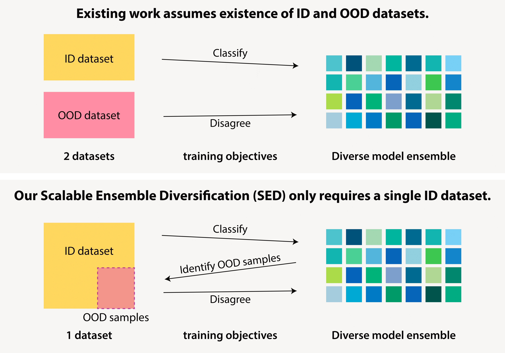

# Scalable Ensemble Diversification for OOD Generalization and Detection

## Overview



This is an implementation of the paper "Scalable Ensemble Diversification for OOD Generalization and Detection".

In the section ["Installation"](#installation) we explain how to create a conda environment with all the necessary libraries. The sections ["Download datasets"](#download-datasets) and ["Download models"](#download-models) describe how to download datasets and models correspondingly. The section ["Evaluate models"](#evaluate-models) explains how to evaluate the models and reproduce the results reported in the paper. The section ["Train models"](#train-models) explains how to train models from scratch without downloading them. The section ["Cache datasets"](#cache-datasets) describes how to cache datasets from scratch without downloading cached datasets. The section ["Note about stuned.run_from_csv.py and .csv files"](#note-about-stunedrun_from_csvpy-and-csv-files) gives additional information about the scripts running pipeline we use in this repository.

All commands are supposed to be run from the root of this repository and all paths are given relatively to it.

## Installation

To create a python environment we use [anaconda](https://www.anaconda.com/).

To create and activate a conda environment with `Python 3.10.4` run the following commands:

```
mkdir ./envs
conda create --yes --prefix ./envs/diverse_universe python==3.10.4
conda activate ./envs/diverse_universe/
pip install -r requirements.txt
pip install git+https://github.com/AlexanderRubinstein/STAI-tuned
pip install git+https://github.com/bethgelab/model-vs-human
```

## Download datasets

 Here we reproduce the results for the Deit3B [1] models with all but the last two layers frozen, therefore outputs of the previous layers can be cached. To save the computation we use these cached outputs (features after the Deit3B feature extractor of size 768) instead of the original images.

To download the cached evaluation datasets (5GB) please run the following command (see ["Data folder structure"](#data-folder-structure) for details of the resulting folders structure):

```
python scripts/download_datasets.py
```

To manually generate such cached features instead of downloading them please follow the instructions in the section ["Cache datasets"](#cache-datasets).

[1] Touvron, Hugo, Matthieu Cord, and Hervé Jégou. "Deit iii: Revenge of the vit." European conference on computer vision. Cham: Springer Nature Switzerland, 2022.

### Data folder structure

Upon a successful `scripts/download_datasets.py` script completion `data` folder will have the following structure (except for the file `in_train_deit3b_-1_4_epochs.hdf5` (15GB), it should be generated separately, see ["Cache datasets"](#cache-datasets) for details):

```
📦data
┗ 📂datasets
  ┗ 📂cached
    ┣ 📂Brightness_1
    ┃ ┗ 📜4c905e75df34398dcc32_...50000_samples.hdf5
    ┣ 📂Brightness_5
    ┃ ┗ 📜ef1173603b558d0a45ac_...50000_samples.hdf5
    ...
    ┣ 📂Zoom Blur_5
    ┃ ┗ 📜3f50303a2e87f30cba0c_torch_...50000_samples.hdf5
    ┣ 📜in_a_deit3b_-1_.hdf5
    ┣ 📜in_r_deit3b_-1_.hdf5
    ┣ 📜in_train_deit3b_-1_4_epochs.hdf5
    ┣ 📜in_val_deit3b_-1.hdf5
    ┣ 📜inat_deit3b_-1_.hdf5
    ┗ 📜oi_deit3b_-1_.hdf5

```

In case the structure above is not clear, here is the huge detailed folder structure:
<details>
<summary>Huge detailed folder structure</summary>

```
📦data
┗ 📂datasets
  ┗ 📂cached
    ┣ 📂Brightness_1
    ┃ ┗ 📜4c905e75df34398dcc32_torch_load_block_-1_model_Brightness_1_dataset_1_epochs_50000_samples.hdf5
    ┣ 📂Brightness_5
    ┃ ┗ 📜ef1173603b558d0a45ac_torch_load_block_-1_model_Brightness_5_dataset_1_epochs_50000_samples.hdf5
    ┣ 📂Contrast_1
    ┃ ┗ 📜06f60745c654a9520111_torch_load_block_-1_model_Contrast_1_dataset_1_epochs_50000_samples.hdf5
    ┣ 📂Contrast_5
    ┃ ┗ 📜54d0f994faaa377581e1_torch_load_block_-1_model_Contrast_5_dataset_1_epochs_50000_samples.hdf5
    ┣ 📂Defocus Blur_1
    ┃ ┗ 📜17f72b4737ec07ba4bd6_torch_load_block_-1_model_Defocus Blur_1_dataset_1_epochs_50000_samples.hdf5
    ┣ 📂Defocus Blur_5
    ┃ ┗ 📜7f3110448c3ed8d9358e_torch_load_block_-1_model_Defocus Blur_5_dataset_1_epochs_50000_samples.hdf5
    ┣ 📂Elastic Transform_1
    ┃ ┗ 📜acf79ca55ab4d737e110_torch_load_block_-1_model_Elastic Transform_1_dataset_1_epochs_50000_samples.hdf5
    ┣ 📂Elastic Transform_5
    ┃ ┗ 📜e66b8c8ee6c13c5ae3f2_torch_load_block_-1_model_Elastic Transform_5_dataset_1_epochs_50000_samples.hdf5
    ┣ 📂Fog_1
    ┃ ┗ 📜a53af9339a7f1b0b0cff_torch_load_block_-1_model_Fog_1_dataset_1_epochs_50000_samples.hdf5
    ┣ 📂Fog_5
    ┃ ┗ 📜26ec818e0e1aead12d19_torch_load_block_-1_model_Fog_5_dataset_1_epochs_50000_samples.hdf5
    ┣ 📂Frost_1
    ┃ ┗ 📜212c00d15df5bb8f6ee3_torch_load_block_-1_model_Frost_1_dataset_1_epochs_50000_samples.hdf5
    ┣ 📂Frost_5
    ┃ ┗ 📜8966e493e280bdd3f429_torch_load_block_-1_model_Frost_5_dataset_1_epochs_50000_samples.hdf5
    ┣ 📂Gaussian Noise_1
    ┃ ┗ 📜bfcca316bfafcb81b0fb_torch_load_block_-1_model_Gaussian Noise_1_dataset_1_epochs_50000_samples.hdf5
    ┣ 📂Gaussian Noise_5
    ┃ ┗ 📜bd673de597fcc458c6a8_torch_load_block_-1_model_Gaussian Noise_5_dataset_1_epochs_50000_samples.hdf5
    ┣ 📂Glass Blur_1
    ┃ ┗ 📜6c9e90c11ce99d332547_torch_load_block_-1_model_Glass Blur_1_dataset_1_epochs_50000_samples.hdf5
    ┣ 📂Glass Blur_5
    ┃ ┗ 📜2ba45b43aeadbbebc5cf_torch_load_block_-1_model_Glass Blur_5_dataset_1_epochs_50000_samples.hdf5
    ┣ 📂Impulse Noise_1
    ┃ ┗ 📜89c69318456d3562dec5_torch_load_block_-1_model_Impulse Noise_1_dataset_1_epochs_50000_samples.hdf5
    ┣ 📂Impulse Noise_5
    ┃ ┗ 📜23e3b3a61c287e4faccf_torch_load_block_-1_model_Impulse Noise_5_dataset_1_epochs_50000_samples.hdf5
    ┣ 📂JPEG Compression_1
    ┃ ┗ 📜01249fa5a2fefca8df44_torch_load_block_-1_model_JPEG Compression_1_dataset_1_epochs_50000_samples.hdf5
    ┣ 📂JPEG Compression_5
    ┃ ┗ 📜9df87ead629ce19e8382_torch_load_block_-1_model_JPEG Compression_5_dataset_1_epochs_50000_samples.hdf5
    ┣ 📂Motion Blur_1
    ┃ ┗ 📜97b8fb397256779609f6_torch_load_block_-1_model_Motion Blur_1_dataset_1_epochs_50000_samples.hdf5
    ┣ 📂Motion Blur_5
    ┃ ┗ 📜9b039bf01d50d7da9fc3_torch_load_block_-1_model_Motion Blur_5_dataset_1_epochs_50000_samples.hdf5
    ┣ 📂Pixelate_1
    ┃ ┗ 📜e79420e9ba75df1c85f4_torch_load_block_-1_model_Pixelate_1_dataset_1_epochs_50000_samples.hdf5
    ┣ 📂Pixelate_5
    ┃ ┗ 📜9dfdc488399ede57caae_torch_load_block_-1_model_Pixelate_5_dataset_1_epochs_50000_samples.hdf5
    ┣ 📂Shot Noise_1
    ┃ ┗ 📜caa167b4008437dfcb14_torch_load_block_-1_model_Shot Noise_1_dataset_1_epochs_50000_samples.hdf5
    ┣ 📂Shot Noise_5
    ┃ ┗ 📜d25ecb59430dcdc330ad_torch_load_block_-1_model_Shot Noise_5_dataset_1_epochs_50000_samples.hdf5
    ┣ 📂Snow_1
    ┃ ┗ 📜3bceaf6152ba08e6b53f_torch_load_block_-1_model_Snow_1_dataset_1_epochs_50000_samples.hdf5
    ┣ 📂Snow_5
    ┃ ┗ 📜f245dd6976ed846f2e98_torch_load_block_-1_model_Snow_5_dataset_1_epochs_50000_samples.hdf5
    ┣ 📂Zoom Blur_1
    ┃ ┗ 📜80ceeb0cf71e8b72e411_torch_load_block_-1_model_Zoom Blur_1_dataset_1_epochs_50000_samples.hdf5
    ┣ 📂Zoom Blur_5
    ┃ ┗ 📜3f50303a2e87f30cba0c_torch_load_block_-1_model_Zoom Blur_5_dataset_1_epochs_50000_samples.hdf5
    ┣ 📜in_a_deit3b_-1_.hdf5
    ┣ 📜in_r_deit3b_-1_.hdf5
    ┣ 📜in_train_deit3b_-1_4_epochs.hdf5
    ┣ 📜in_val_deit3b_-1.hdf5
    ┣ 📜inat_deit3b_-1_.hdf5
    ┗ 📜oi_deit3b_-1_.hdf5
```
</details>

## Download models

To download the models for evaluation (3.2GB) please run the following command (see ["Models folder structure"](#models-folder-structure) for details of the resulting folders structure):

```
python scripts/download_models.py
```

To train the models from scratch instead of downloading them please follow the instructions in the section "Train models".

### Models folder structure

Upon a successful `scripts/download_models.py` script completion the `models` folder will have the following structure:

```
📦models
 ┗ 📂symlinked
   ┣ 📜50_models.pkl
   ┣ 📜ood_det_cov.pkl
   ┣ 📜ood_det_sem.pkl
   ┗ 📜ood_gen.pkl
```

## Train models

Make sure that cached train and validation datasets `in_train_deit3b_-1_4_epochs.hdf5` and `in_val_deit3b_-1.hdf5` are in the `data` folder with the structure described in [Data folder structure](#data-folder-structure).

To train the models from scratch instead of downloading them please run the following command (see ["Note about stuned.run_from_csv.py and .csv files"](#note-about-stunedrun_from_csvpy-and-csv-files) for details):

```
export ROOT=./ && export ENV=$ROOT/envs/diverse_universe && export PROJECT_ROOT_PROVIDED_FOR_STUNED=$ROOT && conda activate $ENV && python -m stuned.run_from_csv --conda_env $ENV --csv_path $ROOT/result_sheets/training.csv --run_locally --n_groups 1
```

Upon a successful scripts completion `result_sheets/training.csv` will look like `result_sheets/filled_training.csv`.

## Evaluate models

Make sure that models are in the folder `models/symlinked/` and have the structure described in ["Models folder structure"](#models-folder-structure).

Make sure that cached datasets are in the folder `data/datasets/cached/` that has structure described in the section [Data folder structure](#data-folder-structure) (file `in_train_deit3b_-1_4_epochs.hdf5` can be omitted as it is not used for evaluation).

To evaluate the models run the command (see ["Note about stuned.run_from_csv.py and .csv files"](#note-about-stunedrun_from_csvpy-and-csv-files) for details):

```
export ROOT=./ && export ENV=$ROOT/envs/diverse_universe && export PROJECT_ROOT_PROVIDED_FOR_STUNED=$ROOT && conda activate $ENV && python -m stuned.run_from_csv --conda_env $ENV --csv_path $ROOT/result_sheets/evaluation.csv --run_locally --n_groups 1
```

Upon a successful scripts completion `result_sheets/evaluation.csv` will look like `result_sheets/filled_evaluation.csv` and the file `result_pickles/eval_results.pkl` will be created.

To generate the final result tables please run the following command:

```
python scripts/generate_result_tables.py
```

Upon the script completion the the files `result_tables/ood_gen_df.csv` for OOD generalization and `result_tables/ood_det_df.csv` for OOD detection should look like `result_tables/filled_ood_gen_df.csv` and `result_tables/filled_ood_det_df.csv` correspondingly. They will contain the following tables that mimic the results from the paper.

OOD generalization results for ensemble accuracy. They reproduce rows for SED-A2D with 50 and 5 models correspondingly in the Table 1 for ensemble accuracy in the paper:

|              | in_val | imagenet_a | imagenet_r | C-1  | C-5  |
|--------------|--------|------------|------------|------|------|
| 50_models_   |   83.6 |       **50.6** |       **53.8** | 75.8 | 39.3 |
| ood_gen_     |   **85.3** |       43.0 |       48.7 | **77.3** | **40.7** |

OOD detection AUROC results for PDS (called "div_continous_unique_per_sample" in the code). They reproduce row SED-A2D for covariate and semantic shift columns correspondingly in the Table 3 in the paper:

|              | C-1 | C-5 | iNaturalist | OpenImages  |
|--------------|--------|------------|------------|------|
| ood_det_cov_   |   **0.681** |      **0.894** |   0.932 |   0.912 |
| ood_det_sem_   |   0.662 |   0.879 |   **0.977** |   **0.941** |

Please note that results may differ depending on the [CUDA](https://developer.nvidia.com/cuda-toolkit) version, the results above are computed for CUDA 12.2.

## Cache datasets

Make sure that folder does not already contain cached datasets you want to cache (otherwise the existing cached datasets will be reused and no new cached datasets will be generated).

To cache the datasets run the following command (see ["Note about stuned.run_from_csv.py and .csv files"](#note-about-stunedrun_from_csvpy-and-csv-files) for details):

```
export ROOT=./ && export ENV=$ROOT/envs/diverse_universe && export PROJECT_ROOT_PROVIDED_FOR_STUNED=$ROOT && conda activate $ENV && python -m stuned.run_from_csv --conda_env $ENV --csv_path $ROOT/result_sheets/caching.csv --run_locally --n_groups 1
```
This command will automatically download iNaturalist (3.7GB) and OpenImages (5.5GB) datasets as described [here](https://github.com/haoqiwang/vim?tab=readme-ov-file).
Upon a successful script completion `result_sheets/caching.csv` will look like `result_sheets/filled_caching.csv`.

## Note about stuned.run_from_csv.py and .csv files

.csv files are created for compact scripts running and logs recording using separate repository ["STAI-tuned"](https://github.com/AlexanderRubinstein/STAI-tuned). To run the scrips from the .csv file it should be submitted by the commands specified in the relevant sections, such as e.g:

```
export ROOT=./ && export ENV=$ROOT/envs/diverse_universe && export PROJECT_ROOT_PROVIDED_FOR_STUNED=$ROOT && conda activate $ENV && python -m stuned.run_from_csv --conda_env $ENV --csv_path $ROOT/result_sheets/evaluation.csv --run_locally --n_groups 1
```

### .csv file structure

- Each line of a .csv file corresponds to one run of the script written in the column "path_to_main".
- The script from the "path_to_main" column is parametrized by the config file specified in the column "path_to_default_config".
- The config from the "path_to_default_config" column is modified by the columns that start with keyword "delta:<...>".

### "n_groups" argument

`--n_groups k` means that `k` lines will be running at a time.

### logs

The logs from running each row (more precisely, the script in this row) are stored in the `stderr.txt` and `stdout.txt` files inside the folder specified in the "run_folder" column which will be automatically generated after submitting a .csv file.

### "whether_to_run" column

"whether_to_run" column can be modified to select the rows to run. After the .csv file submission only the rows that had `1` in this column are executed.
Whenever a script from some row successfully completes the corresponding value in the column "whether_to_run" changes from `1` to `0`. To rerun the same script 0 should be changed to 1 again.

### "status" column

Immediately after the .csv file submission for the rows that are being run a "status" column will be created (if it does not exist) with the value `Submitted` in it. Once corresponding sripts start running the "status" value will change to `Running`. Once the script completes status will become `Complete`. If the script fails its status will be `Fail`.

If something does not allow the script to start the status can be stuck with `Submitted` value. In that case please check the submission log file which is by default in `tmp/tmp_log_for_run_from_csv.out`.

## Citation
